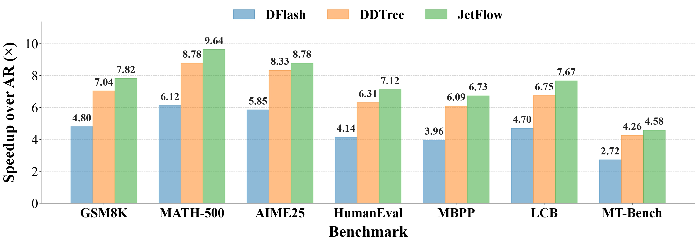

<p align="center">
  
</p>

<div align="center"><h1>JetSpec: Parallel Tree Drafting</h1></div>

<p align="center">
  <a href="https://hao-ai-lab.github.io/JetSpec">Project Webpage</a> ·
  <a href="https://arxiv.org/pdf/2606.18394">Paper</a> ·
  <a href="https://huggingface.co/JetSpec">Hugging Face</a>
</p>

JetSpec is an implementation of **parallel tree drafting** for fast LLM speculative decoding inference with up to 10x acceptance length, and 1000+ TPS on coding and math tasks using B200 GPUs. A causal-parallel draft head proposes a token tree, and the frozen target model verifies the whole tree in one forward pass under a tree-causal attention mask. The accepted path is selected in accordance with the target's own logits, so decoding is lossless by construction.


## Contents

- [Introduction](#introduction)
- [Installation](#installation)
- [Model Weights](#model-weights)
- [Repo Overview](#repo-overview)
- [Usage](#usage)
  - [HF References](#hf-references)
  - [JetSpec Inference Engine](#jetspec-inference-engine)
  - [Benchmarking Scripts](#benchmarking-scripts)
- [Results](#results)
  - [Engine Results](#engine-results)
  - [Tree Algorithms](#tree-algorithms)
- [Citation](#citation)

## Introduction

Speculative decoding is fast when the target accepts many draft tokens and drafting remains cheap. Prior heads often trade off those two terms: autoregressive drafters condition on each path but pay a forward pass per depth, while block-diffusion drafters draft many positions in one pass but score branches independently.

JetSpec keeps the **one-pass drafting efficiency and restores causal branch conditioning**. The draft head reads fused hidden states from the frozen target and emits per-depth logits in a single parallel pass. Tree construction spends a draft budget over high-probability branches, and the target verifies every node in one batched/tree-masked forward.

On Qwen3-8B evaluations, JetSpec reaches up to **9.64x end-to-end speedup on MATH-500**, with strong gains across reasoning, code, and chat workloads: 7.82x on GSM8K, 8.78x on AIME25, 7.12x on HumanEval, 6.73x on MBPP, 7.67x on LCB, and 4.58x on MT-Bench.


<p align="center">
  
</p>


## Installation

Create an environment and install the package:

```bash
cd /root/workspace/JetSpec
pip install -e '.[bench,kernel]'
```

For FlashAttention 2 benchmarks, install the extra after build dependencies are available:

```bash
pip install -e '.[bench,flash-attn]'
```

If you use `uv`, the project includes extra build dependency metadata for `flash-attn`.

## Model Weights

JetSpec draft heads are published under the [`JetSpec`](https://huggingface.co/JetSpec) Hugging Face organization.

| Target family | Draft head |
|---|---|
| Qwen3-8B | [`JetSpec/jetspec-qwen3-8b`](https://huggingface.co/JetSpec/jetspec-qwen3-8b) |
| Qwen3-30B-A3B | [`JetSpec/jetspec-qwen3-30b-a3b`](https://huggingface.co/JetSpec/jetspec-qwen3-30b-a3b) |
| Qwen3.6-35B-A3B | [`JetSpec/jetspec-Qwen3.6-35B-A3B`](https://huggingface.co/JetSpec/jetspec-Qwen3.6-35B-A3B) |
| Gemma4-26B-A4B0-it | [`JetSpec/jetspec-gemma4-26B-A4B0-it`](https://huggingface.co/JetSpec/jetspec-gemma4-26B-A4B0-it) |
| GPT-OSS-20B | [`JetSpec/jetspec-gpt-oss-20b`](https://huggingface.co/JetSpec/jetspec-gpt-oss-20b) |
| Step3p7-Flash | [`JetSpec/jetspec-Step-3.7-Flash`](https://huggingface.co/JetSpec/jetspec-Step-3.7-Flash) |

Most benchmark and diagnostic scripts can read the draft head from `JETSPEC_DRAFT_HEAD`:

```bash
export JETSPEC_DRAFT_HEAD=JetSpec/jetspec-qwen3-8b
```


## Repo Overview

The project has two execution paths:

- `jetspec/core/`: a lightweight HuggingFace-based reference implementation.
- `jetspec/inference_engine/`: an optimized serving engine with paged KV, custom Triton tree attention, and CUDA graphs for better wall-clock latency and throughput.

```text
jetspec/
  core/                 # HuggingFace reference core: LLM, ModelRunner, sampler, tree attention hook
  inference_engine/     # optimized JetSpec engine: paged KV, scheduler, kernels, CUDA graphs
  tree/                 # engine-agnostic tree construction and acceptance
  models/               # target/draft-head loading and model utilities
  draft.py              # simple drafters used in tests and correctness gates
  draft_head_adapter.py # trained draft-head adapter
```


## Usage

### HF References

```python
from jetspec import LLM, SamplingParams

llm = LLM("Qwen/Qwen3-8B", attn_implementation="flash_attention_2")
out = llm.generate(
    "The three primary colors are",
    SamplingParams(temperature=0.0, max_new_tokens=64),
)
print(out["text"])
```


### JetSpec Inference Engine

The optimized engine uses paged KV, a Triton tree-attention backend, compiled verification, CUDA graphs, and optional session reuse.

```python
from jetspec import load_draft_head, DraftHeadTreeDrafter
from jetspec.inference_engine import JetSpecEngine, SamplingParams

engine = JetSpecEngine(
    "Qwen/Qwen3-8B",
    attn_backend="triton_paged_tree_compiled",
)
head = load_draft_head("JetSpec/jetspec-qwen3-8b")
drafter = DraftHeadTreeDrafter(
    head,
    target=engine.model,
    block_size=head.block_size,
    target_layer_ids=head.target_layer_ids,
)
out = engine.generate_tree(
    "The three primary colors are",
    drafter,
    block_size=head.block_size,
    tree_width=7,
    budget=63,
    target_layer_ids=head.target_layer_ids,
    sampling_params=SamplingParams(temperature=0.0, max_new_tokens=64),
)
print(out["text"])
print("tokens per forward:", out["tpf"])
```

### Benchmarking Scripts

The benchmark examples below use `Qwen/Qwen3-8B` with drafter `JetSpec/jetspec-qwen3-8b`.

HF reference benchmark:

```bash
CUDA_VISIBLE_DEVICES=0 \
JETSPEC_DRAFT_HEAD=JetSpec/jetspec-qwen3-8b \
python bench/reference/benchmark.py \
  --model Qwen/Qwen3-8B \
  --attn-implementation flash_attention_2 \
  --tree-attn-implementation triton \
  --dataset gsm8k \
  --samples 64 \
  --algos accum_logp \
  --depth 20 \
  --width 7 \
  --budget 255 \
  --max-new 1024 \
  --warmup-rounds 3 \
  --include-dflash-baseline
```

With `--include-dflash-baseline`, the HF reference benchmark reports the shared
AR-greedy baseline, the linear DFlash block baseline using the draft head's
`block_size`, and the selected JetSpec tree-decode algorithms. The DFlash block
baseline is linear block drafting and verification only; it does not use
`--width`, `--budget`, tree attention, or tree construction.


Optimized JetSpec engine with wall-clock latency and throughput benchmarking:

```bash
CUDA_VISIBLE_DEVICES=0 \
JETSPEC_FUSE_GEMMS=1 \
JETSPEC_BACKEND=triton_paged_tree_cudagraph_nogather \
JETSPEC_DRAFT_HEAD=JetSpec/jetspec-qwen3-8b \
python bench/engine/tps_walltime.py \
  --prompt-set gsm8k \
  --samples 64 \
  --max-tokens 2048 \
  --budget 127 \
  --session
```

Run [`our vLLM v1 integration with JetSpec support`](https://github.com/hao-ai-lab/JetSpec) on MATH-500 for performance test:

```bash
VLLM_FORK_DIR=/path/to/JetSpec
TARGET_MODEL=/path/to/Qwen3-30B-A3B
DRAFT_MODEL=/path/to/jetspec-draft-head
PROFILER_DIR=/path/to/output/jetspec-math500
TP_SIZE=4
BATCH_SIZE=1
MAX_TREE_BUDGET=127
MAX_TOKENS=512
MAX_SAMPLES=16

cd "${VLLM_FORK_DIR}"
GPU_MEMORY_UTILIZATION="${GPU_MEMORY_UTILIZATION:-0.90}" \
bash examples/offline_inference/jetspec_profiling_math500_tree_budget_bsz_sweep_dgx_pod.sh \
  --model "${TARGET_MODEL}" \
  --draft-model "${DRAFT_MODEL}" \
  --profiler-dir "${PROFILER_DIR}" \
  --tree-attn-kernel triton \
  --enable-expert-parallel \
  --disable-cascade-attn \
  --cudagraph-mode default \
  --tp-size "${TP_SIZE}" \
  --batch-sizes "${BATCH_SIZE}" \
  --max-num-seqs "${BATCH_SIZE}" \
  --tree-budgets "${MAX_TREE_BUDGET}" \
  --max-tokens "${MAX_TOKENS}" \
  --max-samples "${MAX_SAMPLES}" \
  --num-warmup-runs 1 \
  --profiler none \
  --max-model-len 3072 \
  --max-num-batched-tokens 16384
```

The [`vLLM integration`](https://github.com/hao-ai-lab/JetSpec) supports MATH-500 testing through the command above and HumanEval testing through `examples/offline_inference/jetspec_profiling_humaneval_tree_unit_kvlayout_dgx_pod.sh`.


## Results

### Engine Results

The optimized engine runs single-stream Qwen3-8B tree-speculative decoding with paged KV and CUDA graph verification. Local B200 bf16 measurements, using the production configuration below, closely align with [`vLLM v1 integration`](https://github.com/hao-ai-lab/JetSpec).

| dataset | JetSpec engine TPS | accept_len |
|---|---:|---:|
| MATH-500 | **910.3 tok/s** | 9.60 |
| GSM8K | **791.0 tok/s** | 7.72 |
| HumanEval| **738.6 tok/s** | 7.25 |


### Tree Algorithms

Common algorithms exposed by `bench/reference/benchmark.py`:

| Algorithm | Purpose |
|---|---|
| `accum_logp` | robust breadth-first cumulative-logprob tree; default baseline |
| `top2gap_fanout` | adaptive fanout using the per-depth top-2 logprob gap |
| `task_router` | prompt/task-aware routing over tree shapes |
| `reasoning_router` | reasoning-pattern-aware routing |
| `class_histogram` | class-conditioned profile-guided tree shaping |
| `depth_rank_histogram` | offline profile table over `(depth, rank)` acceptance |


## Citation

```bibtex
@inproceedings{jetspec2026,
  title = {JetSpec: Breaking the Scaling Ceiling of Speculative Decoding with Parallel Tree Drafting},
  author = {Hu, Lanxiang and Feng, Zhaoxiang and Wu, Yulun and Yuan, Haoran and Zhao, Yujie and Qian, Yu-Yang and Wang, Bojun and Zhao, Peng and Jiang, Daxin and Zhu, Yibo and Rosing, Tajana and Zhang, Hao},
  year = {2026},
  url = {https://arxiv.org/abs/2606.18394},
  eprint = {2606.18394},
  note = {Preprint}
}
```
